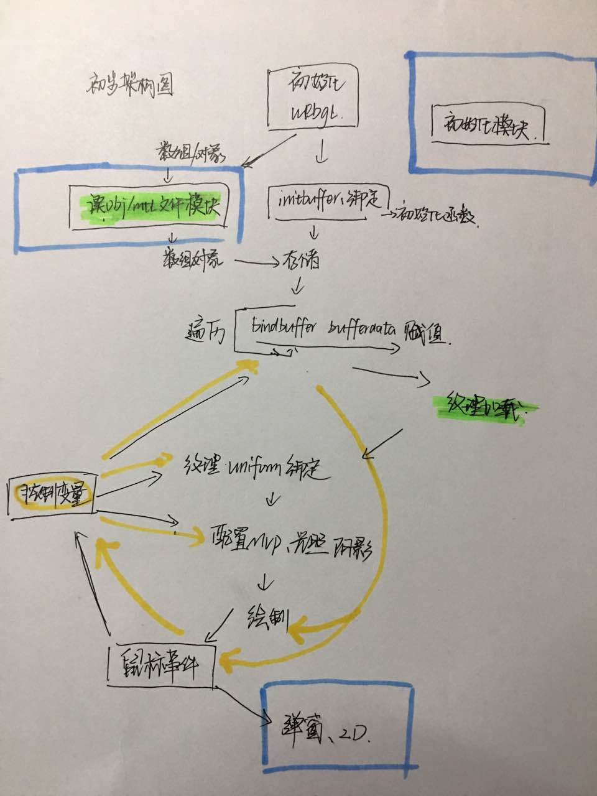

init the program

### 一些代码规范(建议,可改)

1. 为了防止过多的文件同步、异步加载，建议着色器写在js标签中，放在相应的html文件内即可，之后直接读取标签内容也会比较方便，例如：

```
<script id="shader-fs" type="x-shader/x-fragment">
        #ifdef GL_FRAGMENT_PRECISION_HIGH
            precision highp float;
            precision highp int;
        #else
            precision mediump float;
            precision mediump int;
        #endif
        uniform samplerCube s_texture;
        varying vec3 v_texCoord;
        uniform int uiShadowMode;

        void main(void)
        {
            if(uiShadowMode == 0) gl_FragColor = textureCube(s_texture, v_texCoord);
            else if(uiShadowMode == 1) gl_FragColor = vec4(0.7, 0.7, 0.7, 1.0);
            else if(uiShadowMode == 2) gl_FragColor = vec4(1.0, 1.0, 1.0, 1.0);
            else if(uiShadowMode == 3) gl_FragColor = vec4(0.0, 0.0, 1.0, 1.0);
        }
    </script>
```

### 走过的一些坑(大家可以继续补充)

* 在做贴图的时候，贴图的高度和宽度如果不是2的幂次，可能会报错`58RENDER WARNING: texture bound to texture unit 0 is not renderable. It maybe non-power-of-2 and have  incompatible texture filtering or is not 'texture complete`，所以没有特殊情况都把像素调整为2的幂次。

### 整体结构设计

自己简单的梳理了一下WebGL这块的整体结构设计，下图绿色代表异步，蓝色代表单独的文件模块，黄色代表控制数据流：



