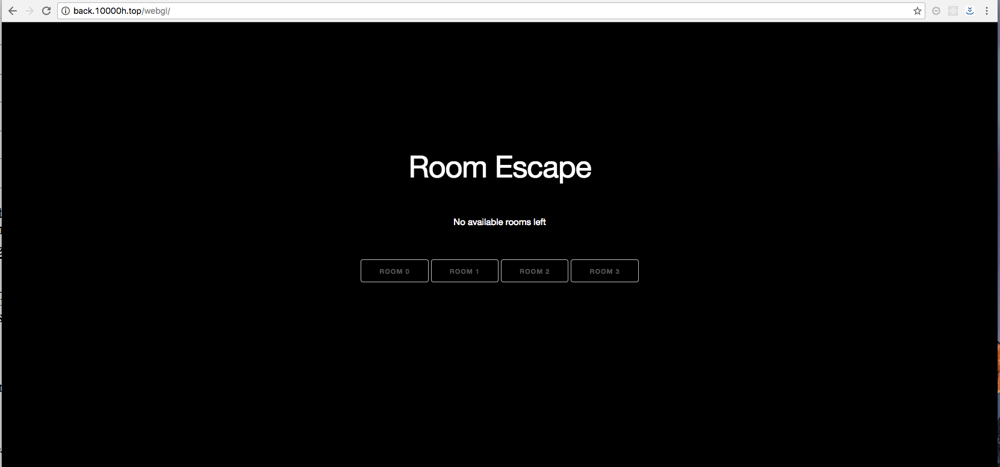
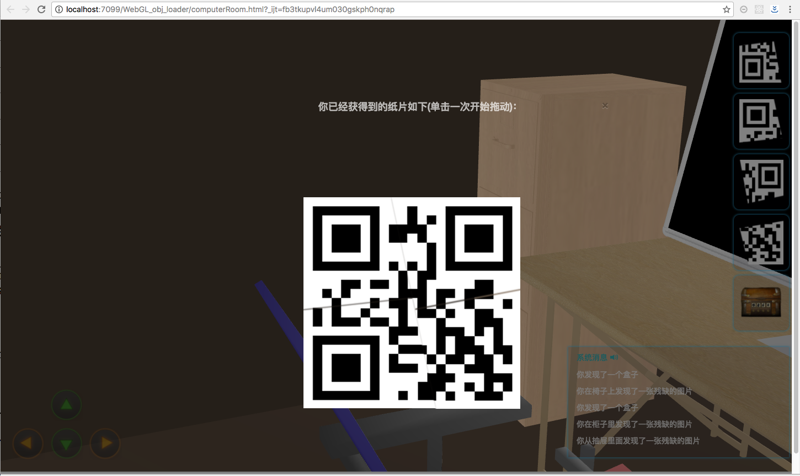
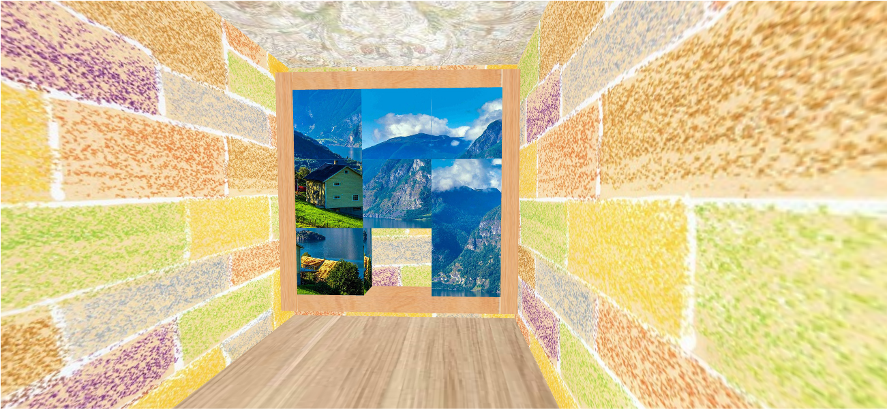

计算机图形学大程报告

### 基于WebGL和WebSocket的多人协作在线密室逃脱

小组成员：

聂小涛 3130104419 

李博 3140105015  

//其他人自行补充姓名学号，最后一个补充的人请删掉这一行

### 目录

* 成果展示
* 技术亮点
* 过程摘要
* 后续讨论
* 附录1：密室逃脱玩法介绍

### 成果展示

>由于附录中有视频，并且我们实现的具体场景较多，玩法较为复杂，这里不对具体介绍，仅说明部分截图。

我们最终实现了基于websocket的密室逃脱联机系统，主界面如下：


基于性能的原因，目前我们的服务器只支持一组玩家同时在线，为了保证游戏的完整性，当一组玩家在线的时候，其余访客是无法进入房间的：



进入房间以后，各个玩家需要相互协作配合才能共同走出房间，这里我们分别给出四个房间的部分截图：

###### room0(聂小涛负责)

一开始是比较昏暗的(电闸控制需要别的小伙伴配合)：


当然，在这个昏暗的场景下，需要搜集一些东西：


房间基于物品，提供了较为丰富的交互操作：

智能密码输入(光标自动移动，保证单个字符输入)


拼图：




还可以操作房间中的电脑：


具体如何走出房间，详见视频。

###### room1(李博负责)

如下图，第一个主题房间的谜题，9格拼图：



当拼图拼好后，通关密码显示


第二个主题房间的二维码


最后房间与大门


### 技术亮点

##### 自行开发框架和obj加载器

花费将近一个月的时间，基于大量的研读资料，开发了框架和obj加载器，测试了300多个模型，可能是目前互联网能找到的最鲁棒的加载器(不包括three.js等框架内加载器,因为没有深入比较，并且缺乏可比性)：


通过自行开发的框架，展示一个obj只需要一行代码：

```
  readOBJFile('./models/cube.obj', modelObject,  mtlArray, objArray, 20, false, 0);
```

再添加一个纹理只需要两行代码：

```
readOBJFile('./models/cube.obj', modelObject,  mtlArray, objArray, 20, false, 0);
 TextureArray[0]={ifTexture:0.0,TextureUrl:'none',n:0};
```

改变透明度、默认颜色、缩放、旋转、方位、只需要三行代码：
```
 readOBJFile('./models/cube.obj', modelObject,  mtlArray, objArray, 20, false, 0);
TextureArray[0]={ifTexture:0.0,TextureUrl:'none',n:0};
updateDrawInfo(0,[0.0,90.0,0.0, 0.0,6.0,0.0, 0.75,0.4,0.5,  0.5,0.5,0.5,1,0 ,1]);
```

通过自行开发的框架，我们通过面条式罗列就可以搭建场景：


这帮助了我们小组搭建了四个功能比较复杂的房间，甚至有的房间比较庞大。

目前已经将obj加载器开源，寒假会进行ES2015和ES2016版本优化。


##### obj绘制加速

由于我们要加载的模型较多，而webgl相对于原始OpenGL性能有限，所以我们需要进行优化。

我们的优化方式简单的讲就是“看不到的模型不绘制”，这样将我们的效率提高了很多(根据所处方位不同，加速比约为2-7，加速比：old drawing time/new drawing time)。这大大提高了用户体验。

原理：最简单的就是通过点积判断，处于我们身后的不绘制，如下图的A、B：


之后我又对这个算法进行优化：

下图A、B、C均不绘制，而长棒需要绘制。


实际上，我们每一个场景建立好后，都有一个临界阀值，我们需要经过多次尝试找到这个临界阀值，保证最高的效率。

##### 支持VR的漫游模型

我们对自己开发的漫游模型进行了改良，使之支持VR设备(通过增加参数，我们的场景可以在手机通过VR进行观看)，

漫游和人眼模型：


在cardboard上的体验如下(仔细观察左右眼的视觉效果的不同)：


##### 丰富的光照系统

* 通过线性雾化，营造黑暗场景下的效果。  
  <!--沈栋你完善一下这一块吧-->
* 通过phong模型改良+漫反射系数+全局平行光改良效果：


由于时间关系，我们这个还有很多改进余地，主要是花太多时间造轮子了。

##### 鼠标拾取、移动物体

* 采用特征颜色方式进行对物体在不到一帧的时间内进行纯色绘制，之后判断点击颜色，从而判断选中的物体。(网上开源技术)
* 采用透明按钮OBJ方式，实现在浏览器中“玩电脑”。
* 采用mousemove监听跟踪方式移动物体

##### WebSocket多人协作

数据实时同步：
<!--这一部分最好也完善下-->


### 过程摘要

过程摘要记录了我们开发中遇到的问题，以及解决方案。

---

###### 一些代码规范

1. 为了防止过多的文件同步、异步加载，建议着色器写在js标签中，放在相应的html文件内即可，之后直接读取标签内容也会比较方便，例如：

```
<script id="shader-fs" type="x-shader/x-fragment">
        #ifdef GL_FRAGMENT_PRECISION_HIGH
            precision highp float;
            precision highp int;
        #else
            precision mediump float;
            precision mediump int;
        #endif
        uniform samplerCube s_texture;
        varying vec3 v_texCoord;
        uniform int uiShadowMode;

        void main(void)
        {
            if(uiShadowMode == 0) gl_FragColor = textureCube(s_texture, v_texCoord);
            else if(uiShadowMode == 1) gl_FragColor = vec4(0.7, 0.7, 0.7, 1.0);
            else if(uiShadowMode == 2) gl_FragColor = vec4(1.0, 1.0, 1.0, 1.0);
            else if(uiShadowMode == 3) gl_FragColor = vec4(0.0, 0.0, 1.0, 1.0);
        }
    </script>
```


###### 走过的一些坑

* 在做贴图的时候，贴图的高度和宽度如果不是2的幂次，可能会报错`58RENDER WARNING: texture bound to texture unit 0 is not renderable. It maybe non-power-of-2 and have  incompatible texture filtering or is not 'texture complete`，所以没有特殊情况都把像素调整为2的幂次。
* 由于读取的文件特别是mtl文件可能编码和我们的机器不同，所以有时候我们在字符串判定的时候需要对字符串进行稍加处理，(用replace去掉空格等)，下面是一个例子：

```
OBJDoc.prototype.findColor = function(name){
    for(var i = 0; i < this.mtls.length; i++){
        for(var j = 0; j < this.mtls[i].materials.length; j++){
            if(this.mtls[i].materials[j].name.replace( /^\s+|\s+$/g, "" ) == name){
                return(this.mtls[i].materials[j].color)
            }
        }
    }
    console.log(this.mtls);
    return(new Color(0.8, 0.8, 0.8, 1));
}
```

* 面可以使用负值索引，有时用负值索引描述面更为简便。

```
v -0.500000 0.000000 0.400000
v -0.500000 0.000000 -0.800000
v -0.500000 1.000000 -0.800000
v -0.500000 1.000000 0.400000
f -4 -3 -2 -1
```

"f -4 -3 -2 -1"这句索引值"-3"表示从"f"这行往上数第3个顶点，就是"v -0.500000 0.000000 -0.800000"，其它的索引值以此类推。 因此与这一行等效的正值索引写法为："f 1 2 3 4"  (聂小涛)

* 花了一天的时间研究有时候WebGL渲染出错的问题(提供一个obj文件，渲染出一团糟的结果)：经过研究，发现目前使用我写的obj读取代码，如果文件稍微大(基本超过5MB就会出错了)就会出错(firefox\chrome)，但是文件在1MB以下或者1-2MB都没有问题，当然，这可能应该是代码的问题，稍微大一点的模型理论上应该还是可以渲染的(虽然点数有点多，大概有几十万个点)。也希望大家可以帮忙看一下我的代码，一起找一下问题.(聂小涛)

* 终于给obj成功贴图...遇到一个大坑：在着色器中如果声明了一个uniform，<u>如果之后没有使用，是取不到的！</u>取到的是null,最终的原因还是因为自己仅仅是声明uniform还没有使用。另外，自己今天又验证了上面的第一点，的确是这样的，这点到底是为什么，自己之后再继续研究。

* 今天晚上终于解决了困扰这几天的大bug，下午甚至都要悬赏了，没想到晚上有了进展找到了问题所在：  
  原问题浮现的场景是这样的：当自己渲染较为复杂的模型的时候，就会出现混乱，且模型越复杂就越混乱，百思不得解，一开始总以为自己的解析函数写错导致的，后来发现真正的原因：    
  *数组越界：自己在定义索引这句话`var indices = new Uint16Array(numIndices);`的时候实际上最大只能为65535，所以当自己的模型变大的时候，显然是要多于65535个点的，这个时候就会从0开始进行循环！*    
  找到问题后那么试着解决问题，很显然，首先想到把Uint16Array改成Uint32Array，这样能在更广的范围内保证数组不会越界，但是自己又找到：    
>通常 ARRAY_BUFFER 将使用 Float\*Array 而 ELEMENT_ARRAY_BUFFER 必须使用 Uint\*Array。 （请不要直接使用js里面的Array数组， 因为它可能是数据没有对齐的, Array数组中的对象可能有不同的类型） 需要特别注意的是， 就目前来看，WebGL在使用 ELEMENT_ARRAY_BUFFER 时，不得使用精度超过 Uint16Array。笔者之前习惯性地使用了 Uint32Array，导致Chrome (版本：34.0.1847.131 m) 一直对此报错。而改为 Uint16Array 之后运行正常，希望引起您的注意。（猜测原因可能是WebGL暂时还不能支持太大量的ARRAY_BUFFER数据从而限制了索引大小）    

这实际上证明上面简单粗暴的解决方法是不对的，应该寻找更为有效的解决方案。目前我的方案大概是进行动态循环绑定。之后绘制(经过尝试这个方法是可以解决这个问题的)，现在自己也在构建自己代码的更完善的解决方案。     
如果这个问题顺利解决，那么我现在重写的这个obj loader的js函数库将是目前最为健壮和完善的加载库（three.js除外,思路和依赖不一样，难以进行比较，并且笔者目前还没有对其进行仔细研读)。
(12.17)这个方案目前已经实现，目前已经更新obj读取函数。

* 调试以下函数调试了很久，注意这里面的x,y是相对canvas的坐标，一开始自己弄错了(然后这种临时颜色替换然后读取颜色判断选中的方式真是又简单又方便)
```
gl.readPixels(x,y,1,1,gl.RGBA,gl.UNSIGNED_BYTE,pixels);
```


### 后续讨论

blablabla

### 附录1：密室逃脱玩法介绍

>背景：四名玩家是四个学生，他们晚上在图书馆自习完毕之后，发现基础图书馆竟然有-2层，顺着电梯来到了-2层，可是马上就晕倒了，醒来的时候，周围的同伴都不见了，他们四个人进入了四个漆黑的房间......

玩家0:    
进入了一个办公室，办公室一开始是没有电的，当然，电脑也无法打开，他需要先找到一个盒子，盒子是需要输入密码的，密码在一个二维码上，而二维码早已变成四个纸片散落在房间各处......找到四个纸片后，通过手机扫描得到密码之后输入密码，从盒子中拿出鼠标。     
这个时候如果别的玩家打开了电闸，他就可以用鼠标操作电脑了，是一个发送邮件的页面，不用犹豫，点击发送。(实际上是发送到别的玩家那去了)    
之后会有一个返回的邮件，上面写了你可以出去的方式：摇动柜子！     
之后摇动一个特定的柜子，终于可以走出房间。  

玩家1:
玩家会进入一间封闭的迷宫密室，这间密室最开始也是没电的(比较暗)，需要电源总闸打开之后才明亮起来。这个密室被分为三个区域，每个区域都有自己的主题，每个房间都有自己的谜题，解开那个谜题后，得到通关密码并可以打开通往下一个房间的房门。
首先，玩家出生在亮色主题房间，在房间中藏着一块拼图，通过上下左右按键把这个拼图拼好后，拼图上的图案会变成一个密码图案，该密码图案是对称的数字。玩家解开这个密码，就可以打开第一个房间的大门。
在第二个房间，需要等待一个伙伴打开他房间的一个机关，这样这个房间的角落里就会有一个二维码显示出来，扫描这个二维码可以得到一个关于数字根的定义。理解了这个定义后根据门上的提示可以算出相关密码，并进入房间三。
第三个房间是第一个房间的反色房间，谜题直接隐藏在迷宫的一个角落，找到谜题并解开，打开最后一扇门就可以走出房间。
